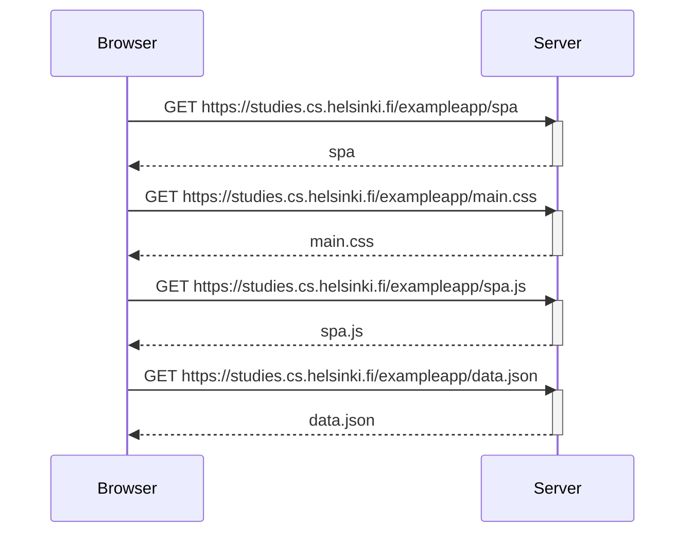

```mermaid
sequenceDiagram
participant Browser
participant Server
Browser->>Server: GET https://studies.cs.helsinki.fi/exampleapp/spa
activate Server
Server-->>Browser: spa
Deactivate Server
Browser->>Server: GET https://studies.cs.helsinki.fi/exampleapp/main.css
activate Server
Server-->>Browser: main.css
Deactivate Server
Browser->>Server: GET https://studies.cs.helsinki.fi/exampleapp/spa.js
activate Server
Server-->>Browser: spa.js
Deactivate Server

Browser->>Server: GET https://studies.cs.helsinki.fi/exampleapp/data.json
activate Server
Server-->>Browser: data.json
Deactivate Server
```
