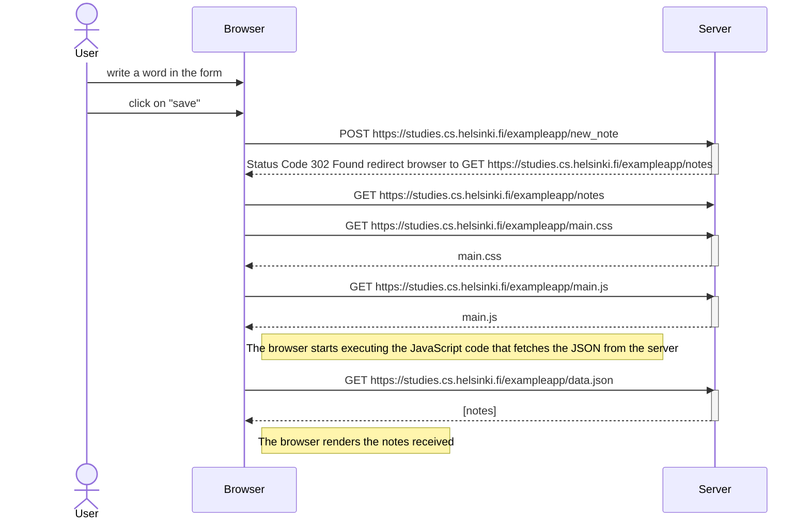

```mermaid
sequenceDiagram
actor User
participant Browser
participant Server
User->>Browser: write a word in the form
User->>Browser: click on "save"
Browser->>Server: POST https://studies.cs.helsinki.fi/exampleapp/new_note
activate Server
Server-->>Browser: Status Code 302 Found redirect browser to GET https://studies.cs.helsinki.fi/exampleapp/notes
Deactivate Server
Browser->>Server: GET https://studies.cs.helsinki.fi/exampleapp/notes
Browser->>Server: GET https://studies.cs.helsinki.fi/exampleapp/main.css
activate Server
Server-->>Browser: main.css
Deactivate Server
Browser->>Server: GET https://studies.cs.helsinki.fi/exampleapp/main.js
activate Server
Server-->>Browser: main.js
Deactivate Server
Note right of Browser: The browser starts executing the JavaScript code that fetches the JSON from the server
Browser->>Server: GET https://studies.cs.helsinki.fi/exampleapp/data.json
activate Server
Server-->>Browser: [notes]
Deactivate Server
Note right of Browser: The browser renders the notes received
```
