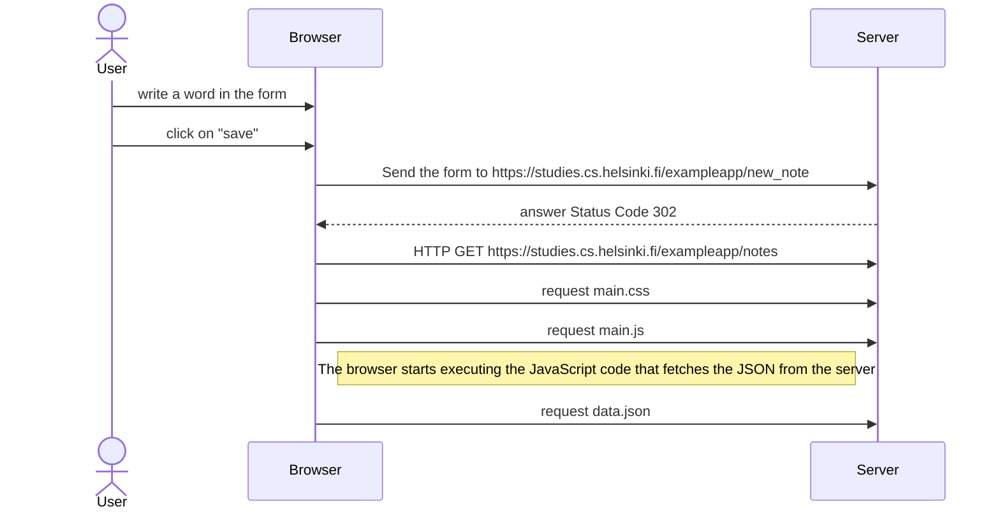

```mermaid
sequenceDiagram
actor User
participant Browser
participant Server
User->>Browser: write a word in the form
User->>Browser: click on "save"
Browser->>Server: Send the form to https://studies.cs.helsinki.fi/exampleapp/new_note
Server-->>Browser: answer Status Code 302
Browser->>Server: HTTP GET https://studies.cs.helsinki.fi/exampleapp/notes
Browser->>Server: request main.css
Browser->>Server: request main.js
Note right of Browser: The browser starts executing the JavaScript code that fetches the JSON from the server
Browser->>Server: request data.json
  
```
