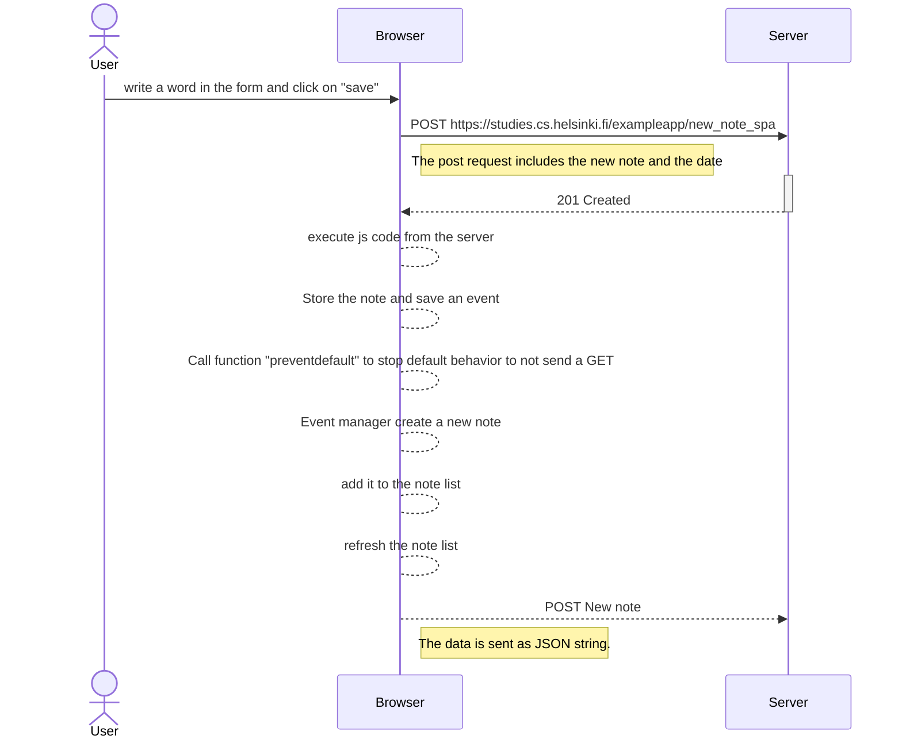

```mermaid
sequenceDiagram

actor User
participant Browser
participant Server
User->>Browser: write a word in the form and click on "save"

Browser->>Server: POST https://studies.cs.helsinki.fi/exampleapp/new_note_spa
Note right of Browser: The post request includes the new note and the date
Activate Server
Server-->>Browser: 201 Created
Deactivate Server
Browser-->Browser: execute js code from the server
Browser-->Browser: Store the note and save an event
Browser-->Browser: Call function "preventdefault" to stop default behavior to not send a GET
Browser-->Browser: Event manager create a new note
Browser-->Browser: add it to the note list
Browser-->Browser: refresh the note list
Browser-->>Server: POST New note
Note right of Browser: The data is sent as JSON string.
```
